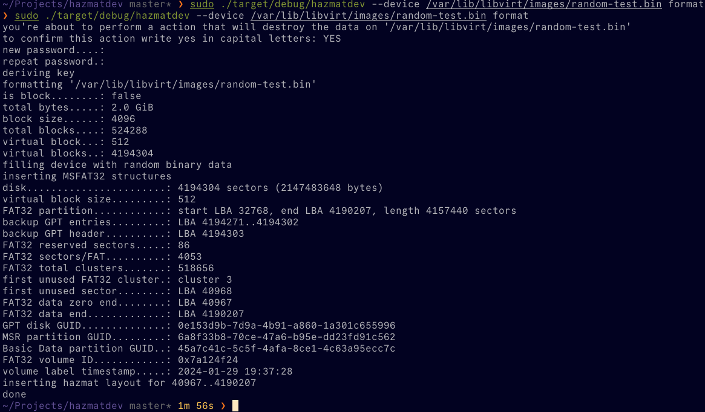
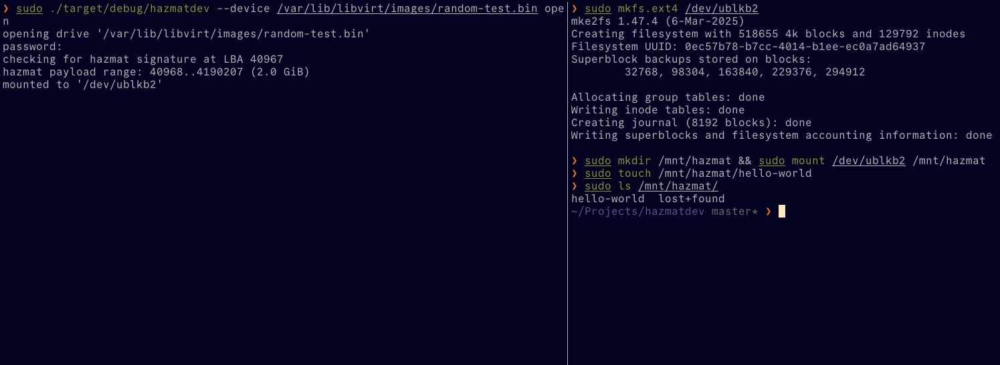
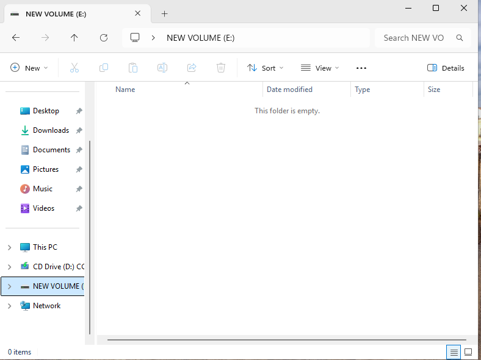
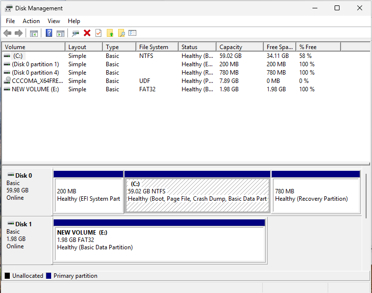

# HAZMAT

Hazmat is open-source software created and designed to hide sensitive data in USB sticks for Linux.

## How does it work?

Drives are sanitized drives with random binary and FAT32 filesystem pretending to be formatted by Windows. Inside the unused clusters of the filesystem is an encapsulated region with AES256 CTR and XOR encryption. When opening a hazmat drive, this region becomes available to your system as a block device if your encryption password is correct. The hazmat app handles the encryption and decryption in motion, and what's left of you is to use this block device -- formatting with any filesystem you want, creating files, deleting, etc.

TLDR: It hides any filesystem you want with your files and folders in the unallocated clusters of FAT32.

Disclaimer: the outer filesystem will be empty and please do not use it or it will overlap with the hazmat region.
Disclaimer: before exiting the hazmat program run the command 'sync' to sync the block buffers.

## Pictures

